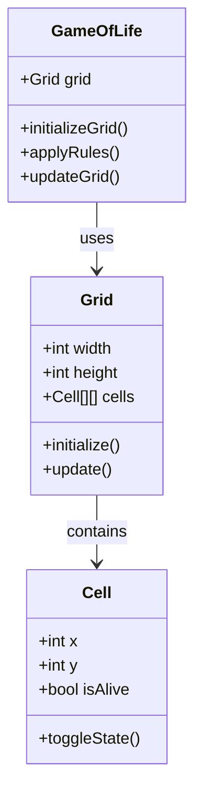

# GitHub-themed Game of Life

## Purpose
This repository contains an implementation of Conway's Game of Life with a GitHub-themed color scheme. The project demonstrates the use of HTML, CSS, and JavaScript to create an interactive grid where cells evolve based on predefined rules.

## Current Implementation
- **HTML**: Sets up the basic structure of the page with a grid container.
- **CSS**: Styles the grid and cells, applying different background colors based on the cell's state.
- **JavaScript**: Contains the logic for initializing the grid, updating cell states, and applying the rules of Conway's Game of Life.

## Class Diagram

This will render the class diagram in your README file, showing how the classes interact.

You can edit and view this diagram in the [Mermaid Chart Playground](https://www.mermaidchart.com/play?utm_source=mermaid_chart&utm_medium=github_copilot&utm_campaign=playground_view#pako:eNp1kM8KwjAMxl-l9KTIXmAHQRR2EQQ9zh3qmnWBuI61U-fYu7t_SDdnDqH59SPJl5rHWgL3eUzCmAMKVYj7NWNt9IQFBUpWD6SLDWaWPVHadMZSQJVaB-6BKIzCiMXtw0zUaFEQvmG1dnCZS2G_qHGX6Fr9LPGa1ZVT37QmhmZH-AAHW60UwcX-mxOIO5ySIyYwmdbfQLVp0UT3OzEi8pyqc0lgFvy56nF2397ztoNNn8U6swKz8WTOTp2mF_usNGB48wGHjH_N).

## How to Contribute
1. Fork the repository.
2. Create a new branch for your feature or bugfix.
3. Make your changes and commit them with descriptive messages.
4. Push your changes to your forked repository.
5. Create a pull request to the main repository.

Please ensure your code follows the existing style and includes comments where necessary.
